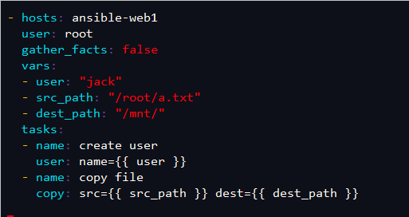
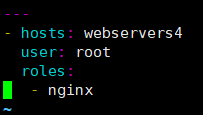

# ansible-playbook

```shell
group模块参数：
name参数：必须参数，用于指定组名称。
state参数：用于指定组的状态，两个值可选，present，absent，默认为 present，设置为absent 表示删除组。
gid参数：用于指定组的gid。如果不指定为随机
system参数:如果是yes为系统组。--可选
=========================================================================================
1.创建多个play
[root@ansible ~]# cd /etc/ansible/
[root@ansible ansible]# vim play.yml
- hosts: webservers1
  user: root
  tasks:
  - name: create a group
    group: name=mygrp gid=2003 system=true
  - name: create a user
    user: name=tom group=mygrp system=true

- hosts: webservers2
  user: root
  tasks:
  - name: install apache
    yum: name=httpd state=latest
  - name: start httpd service
    service: name=httpd state=started
=========================================================================================
```


```shell
检查并执行
[root@ansible ansible]# ansible-playbook --syntax-check play.yml
[root@ansible ansible]# ansible-playbook play.yml
```

```shell
2.条件执行when模块
先判断when条件是否成立
[root@ansible ansible]# cat /etc/ansible/hosts
[webservers1]
ansible-web1
ansible-web2

[root@ansible ansible]# vim when.yml
- hosts: webservers1
  user: root
  tasks:
  - name: use when
    file: state=touch path=/tmp/when.txt
  - name: insert data
    shell: echo 123 >> /tmp/when.txt          #2在执行这个模块命令
    when: ansible_hostname == "ansible-web1"  #1.先条件执行，先判断when是否成立，如果成立则执行上面命令,ansible-web1指的是被控节点上真正的主机名称
```


```shell
执行
[root@ansible ansible]# ansible-playbook when.yml
[root@ansible-web1 ~]# cat /tmp/when.txt
123
[root@ansible-web2 ~]# cat /tmp/when.txt
```

```shell
3.使用变量并不显示搜集主机相关信息
gather_facts参数：指定了在任务部分执行前，是否先执行setup模块获取主机相关信息，默认值为true，改成false之后在执行过程中不会搜集主机相关信息。
==========================================================================================================
[root@ansible ansible]# vim create_user.yml
- hosts: ansible-web1
  user: root
  gather_facts: false  #是否执行setup模块，搜集对方机器的信息
  vars:                #自定义变量
  - user: "jack"       #user是自定义变量名称，“jack”是变量值
  - src_path: "/root/a.txt"    #同上
  - dest_path: "/mnt/"
  tasks:
  - name: create user
    user: name={{ user }}
  - name: copy file
    copy: src={{ src_path }} dest={{ dest_path }}

[root@ansible ansible]# vim /root/a.txt  #创建测试文件
123
```



```shell
执行：
[root@ansible ansible]# ansible-playbook create_user.yml
```

## Role角色

roles则是在ansible中，playbooks的目录组织结构。而模块化之后，成为roles的组织结构，易读，代码可重用，层次清晰。

实战目标：通过role远程部署nginx并配置

```shell
两台机器配置本地解析
[root@ansible-server ~]# vim /etc/hosts
192.168.1.9    ansible-server
192.168.1.13   ansible-web4
[root@ansible-web4 ~]# vim /etc/hosts
192.168.1.9    ansible-server
192.168.1.13   ansible-web4
添加主机组
[root@ansible-server ansible]# pwd
/etc/ansible
[root@ansible-server ansible]# vim hosts
[webservers4]
ansible-web4
配置免密登录：
[root@ansible-server ~]# ssh-copy-id -i 192.168.1.13
```

1.目录结构：


```shell
目录顺序:
role_name/     ---角色名称=目录
    files/：存储一些可以用copy调用的静态文件。
    tasks/： 存储任务的目录,此目录中至少应该有一个名为main.yml的文件，用于定义各task；其它的文件需要由main.yml进行“包含”调用； 
    handlers/:此目录中至少应该有一个名为main.yml的文件，用于定义各handler；其它的文件需要由（与notify:名字相同，方便notify通知执行下一条命令）通过main.yml进行“包含”调用； 
    vars/：此目录中至少应该有一个名为main.yml的文件，用于定义各variable；其它的文件需要由main.yml进行“包含”调用； 
    templates/：存储由template模块调用的模板文本； （也可以调用变量）
    site.yml：定义哪个主机应用哪个角色
=========================================================================================
1.准备目录结构
[root@ansible-server ~]# cd /etc/ansible/roles/  #roles为自带目录，如果不存在可以创建
[root@ansible-server roles]# mkdir nginx/{files,handlers,tasks,templates,vars} -p
2.创建文件
[root@ansible-server roles]# touch site.yml nginx/{handlers,tasks,vars}/main.yml
[root@ansible-server roles]# yum install -y tree
```


```shell
1.创建nginx的测试文件
[root@ansible-server roles]# echo 1234 > nginx/files/index.html
2.安装nginx并配置模板
[root@ansible-server roles]# yum install -y nginx && cp /etc/nginx/nginx.conf nginx/templates/nginx.conf.j2
```

```shell
3.编写任务
[root@ansible-server roles]# vim nginx/tasks/main.yml
---
- name: install epel
  yum: name=epel-release state=latest
- name: install nginx
  yum: name=nginx state=latest
- name: copy nginx.conf templte
  template: src=nginx.conf.j2 dest=/etc/nginx/nginx.conf
- name: copy index.html
  copy: src=/etc/ansible/roles/nginx/files/index.html dest=/usr/share/nginx/html/index.html
  notify: start nginx
```


```shell
4.准备配置文件
[root@ansible-server roles]# vim nginx/templates/nginx.conf.j2
修改成如下内容。自定义变量
```


```shell
5.编写变量
[root@ansible-server roles]# vim nginx/vars/main.yml  #添加如下内容
worker_connections: 2
```

```shell
6.编写handlers
[root@ansible-server roles]# vim nginx/handlers/main.yml #编写如下内容
---
- name: start nginx  #和notify的名字必须一样
  service: name=nginx state=started
```

```shell
7.编写剧本
[root@ansible-server roles]# vim site.yml
---
- hosts: webservers4
  user: root
  roles:
   - nginx
```



```shell
检测语法
[root@ansible-server roles]# ansible-playbook site.yml --syntax-check
playbook: site.yml
执行剧本：
[root@ansible-server roles]# ansible-playbook site.yml
```

查看：

```shell
[root@ansible-web4 ~]# netstat -lntp 
Active Internet connections (only servers)
Proto Recv-Q Send-Q Local Address           Foreign Address         State       PID/Program name    
tcp        0      0 0.0.0.0:80              0.0.0.0:*               LISTEN      3102/nginx: master  
tcp        0      0 0.0.0.0:22              0.0.0.0:*               LISTEN      926/sshd            
tcp        0      0 127.0.0.1:25            0.0.0.0:*               LISTEN      1007/master         
tcp6       0      0 :::80                   :::*                    LISTEN      3102/nginx: master  
tcp6       0      0 :::22                   :::*                    LISTEN      926/sshd            
tcp6       0      0 ::1:25                  :::*                    LISTEN      1007/master         
[root@ansible-web4 ~]# cat /etc/nginx/nginx.conf | grep pro
#worker_processes auto;
worker_processes 2;
```

访问：


# 项目实战：通过ansible上线

## 批量部署Jdk+Tomcat

```shell
[root@ansible-server src]# cat tomcat.yml
- hosts: webservers
  user: root
  tasks:
##配置JDK，上传jdk、tomcat的安装包到/usr/src
  - name: configure Jdk1.8
    copy: src=/usr/src/jdk-8u211-linux-x64.tar.gz  dest=/usr/src
  - name: unzip
    shell: tar -xvzf /usr/src/jdk-8u211-linux-x64.tar.gz -C /usr/local
  - name: rename to java
    shell: mv /usr/local/jdk1.8.0_211 /usr/local/java
  - name: configure envirement1
    shell: echo "JAVA_HOME=/usr/local/java" >> /etc/profile
  - name: configure envirement2
    shell: echo 'PATH=$JAVA_HOME/bin:$PATH' >> /etc/profile
##Tomcat
  - name: copy tomcat
    copy: src=/usr/src/apache-tomcat-8.5.45.tar.gz dest=/usr/src
  - name: unzip tomcat
    shell: tar -xvzf /usr/src/apache-tomcat-8.5.45.tar.gz -C /usr/local
  - name: rename to tomcat
    shell: mv /usr/local/apache-tomcat-8.5.45 /usr/local/tomcat
  - name: copy startup file
    copy:  src=/usr/src/startup.sh dest=/usr/local/tomcat/bin
    notify: start tomcat
  handlers:
  - name: start tomcat
    shell: nohup /usr/local/tomcat/bin/startup.sh &
[root@java-server src]# ls
apache-tomcat-8.5.45         debug                       kernels     tomcat.retry
apache-tomcat-8.5.45.tar.gz  jdk-8u211-linux-x64.tar.gz  startup.sh  tomcat.yml
[root@java-server src]# head -2 startup.sh 
#!/bin/sh
source /etc/profile
```

## 批量部署Jenkins

```shell
项目描述：
1.准备两台机器，一台作为nginx代理。一台为tomcat服务器。
2.tomcat服务器手动部署tomcat服务，并将webapps目录下面的内容提前删掉。
3.将jenkins.war包上传到nginx服务器。通过ansible将war包拷贝过去。并启动tomcat
4.配置nginx反向代理tomcat，实现访问jenkins。
操作如下:
一、tomcat服务器
1.安装jdk与tomcat略。
2.添加tomcat启动脚本中添加环境变量
[root@ansible-web2 ~]# vim /usr/local/tomcat/bin/startup.sh  #需要添加如下内容
source /etc/profile
====================================
二、nginx服务器：
1.安装nginx与ansible，上传jenkins的war包略。
2.ansible配置如下：
3.定义变量：
[root@ansible ~]# cd /etc/ansible/
[root@ansible ansible]# mkdir vars
[root@ansible ansible]# vim vars/path.yml
src_path: /root/jenkins.war
dest_path: /usr/local/tomcat/webapps/

4.配置playbook：
[root@ansible ansible]# vim jenkins.yml
- hosts: webserver2
  user: root
  vars_files:
   - /etc/ansible/vars/path.yml
  tasks:
  - name: copy jenkins.war
    copy: src={{ src_path }} dest={{ dest_path }}
  - name: start tomcat
    shell: nohup /usr/local/tomcat/bin/startup.sh &
[root@ansible ansible]# ansible-playbook jenkins.yml

5.配置nginx反向代理
[root@ansible ansible]# vim /etc/nginx/conf.d/jenkins.conf
server {
    listen       80;
    server_name  localhost;

    charset koi8-r;
    access_log  /var/log/nginx/host.access.log  main;

    location /jenkins {
        proxy_pass http://192.168.62.181:8080;
        proxy_set_header Host $host:$server_port;
        proxy_set_header X-Real-IP $remote_addr;
        proxy_set_header X-Forwarded-For $proxy_add_x_forwarded_for;
    }

}

6.启动nginx
7.检查nginx与tomcat是否启动成功！
8.访问nginx服务器http://ip/jenkins。
```

## 批量部署Jdk+Tomcat+Jenkins

```shell
将Jdk、Tomcat、Jenkins的安装包上传到ansbile控制节点的/usr/src下
[root@ansible ansible]# ls /usr/src/
```


```shell
[root@java-server ansible]# head -2 /usr/src/startup.sh 	//startup.sh是tomcat的启动脚本
#!/bin/sh
source /etc/profile    #加上此行，是为了启动加载到环境变量
```

下面是变量文件

```shell
变量文件
[root@ansible ansible]# cat /etc/ansible/vars/file.yml
```


下面是剧本

```shell
[root@ansible ansible]# cat jenkins.yml
- hosts: ansible-web1
  user: root
  vars_files:
  - /etc/ansible/vars/file.yml
  tasks:
##配置JDK，上传jdk、tomcat的安装包到/usr/src
  - name: configure JDK1.8
    copy: src={{ src_jdk_path }}  dest={{ dest_jdk_path }}
  - name: unzip JDK
    shell: tar -xvzf /usr/src/jdk-8u211-linux-x64.tar.gz -C /usr/local
  - name: rename to java
    shell: mv /usr/local/jdk1.8.0_211 /usr/local/java
  - name: configure JDK envirement1
    shell: echo "JAVA_HOME=/usr/local/java" >> /etc/profile
  - name: configure JDK envirement2
    shell: echo 'PATH=$JAVA_HOME/bin:$PATH' >> /etc/profile
##Tomcat
  - name: copy tomcat
    copy: src={{ src_tomcat_path }} dest={{ dest_tomcat_path }}
  - name: unzip tomcat
    shell: tar -xvzf /usr/src/apache-tomcat-8.5.45.tar.gz -C /usr/local
  - name: rename to tomcat
    shell: mv /usr/local/apache-tomcat-8.5.45 /usr/local/tomcat
  - name: copy startup file
    copy: src=/usr/src/startup.sh dest=/usr/local/tomcat/bin
##Jenkins
  - name: copy jenkins
    copy: src=/usr/src/jenkins.war  dest=/usr/local/tomcat/webapps/
    notify: start jenkins
  handlers:
  - name: start jenkins
    shell: nohup /usr/local/tomcat/bin/startup.sh &
```


## 查资料（懂得多，面试说的多，走得快）：

### ＝＝服务器并托管＝＝

```shell
1.了解DELL常见服务器的价格、型号、配置（CPU，内存、硬盘、支持的RAID功能）
2.了解HP常见服务器的价格、型号、配置（CPU，内存、硬盘、支持的RAID功能）
3.了解常见的硬盘接口类型、速率、价格如：ATA, SATA, SCSI, SAS, FC4. 
4.了解国内主要是北京托管商的信息如：厂商名称、托管的价格、地理位置（光环新网/世纪互联）
```

### ＝＝云主机＝＝

```shell
1.了解阿里云价格、基本部署
2.了解华为云价格、基本部署
3.了解腾讯云价格、基本部署
```

### ＝＝DNS 解析＝＝

```shell
1.了解国内主要的DNS ISP如万网、新网、DNSPOD、阿里DNS
```

### ＝＝CDN 技术＝＝

```
1.了解国内主要的3家CDN ISP，对比其价格、性能、市场的占有率等
```

